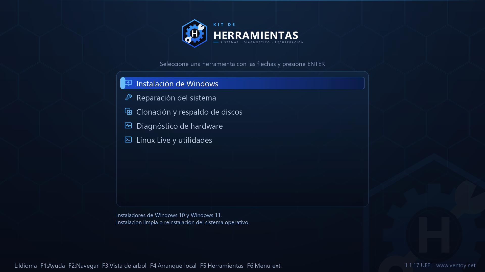
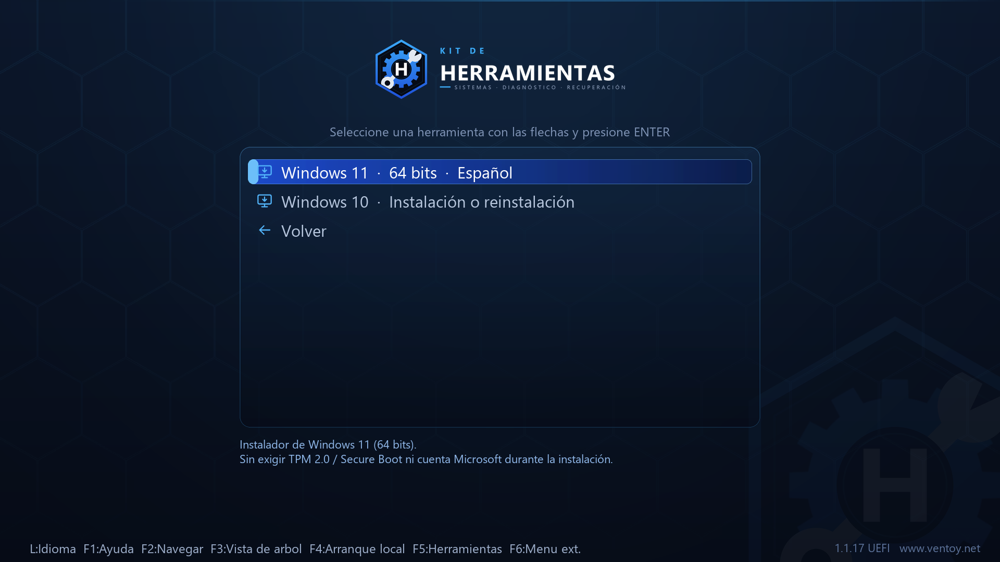
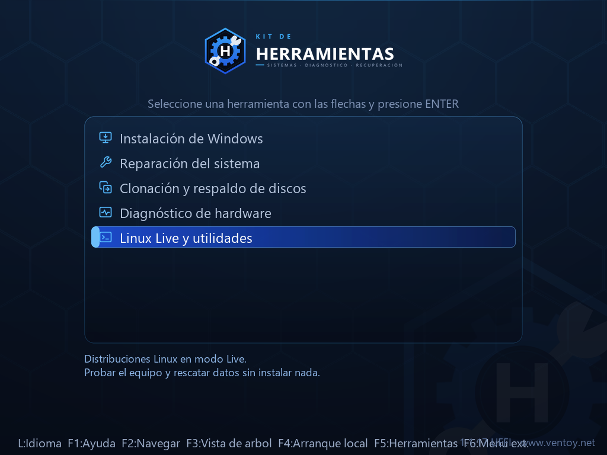

<div align="center">

# Ventoy Theme Template

**Plantilla de tema en español para memorias USB multiarranque con
[Ventoy](https://www.ventoy.net).**

Menú organizado por categorías, con iconos y descripciones, para 1920×1080,
1366×768 y 1024×768.


<sub>↑ Este logo es solo la **marca de ejemplo** que trae la plantilla.
Cambias un archivo de configuración, ejecutas un comando, y el logo, el fondo,
los iconos y el menú se rehacen con la tuya.</sub>

</div>

---



<table>
<tr>
<td width="50%"></td>
<td width="50%"></td>
</tr>
</table>

---

## Contenido

- [Qué es esto](#qué-es-esto)
- [Qué necesitas](#qué-necesitas)
- [Guía paso a paso: de una USB vacía al menú funcionando](#guía-paso-a-paso-de-una-usb-vacía-al-menú-funcionando)
  - [Paso 1 — Descargar Ventoy](#paso-1--descargar-ventoy)
  - [Paso 2 — Instalar Ventoy en la USB](#paso-2--instalar-ventoy-en-la-usb-borra-todo-el-contenido)
  - [Paso 3 — Descargar este proyecto](#paso-3--descargar-este-proyecto)
  - [Paso 4 — Copiar la carpeta `ventoy` a la USB](#paso-4--copiar-la-carpeta-ventoy-a-la-usb)
  - [Paso 5 — Crear las carpetas de categorías](#paso-5--crear-las-carpetas-de-categorías)
  - [Paso 6 — Copiar tus ISOs](#paso-6--copiar-tus-isos)
  - [Paso 7 — Poner tus ISOs en el menú](#paso-7--poner-tus-isos-en-el-menú)
  - [Paso 8 — Expulsar y arrancar](#paso-8--expulsar-y-arrancar)
- [Poner tu propia marca](#poner-tu-propia-marca)
- [Estructura del repositorio](#estructura-del-repositorio)
- [Solución de problemas](#solución-de-problemas)
- [Créditos y licencia](#créditos-y-licencia)

---

## Qué es esto

Ventoy convierte una memoria USB en un menú de arranque: copias archivos `.iso`
a la memoria y al arrancar el equipo aparecen en una lista. El menú que trae de
fábrica es funcional, pero muestra los nombres de archivo tal cual y sin ningún
orden.

Este repositorio es **una plantilla** que convierte ese menú en algo
presentable. Puedes usarla tal cual, o ponerle tu propia marca:

| Ventoy de fábrica | Con esta plantilla |
|---|---|
| Lista plana de nombres de archivo | Cinco categorías: Windows, Reparación, Clonación, Diagnóstico, Linux |
| `HBCD_PE_x64.iso` | `Hiren's BootCD PE · Kit de rescate WinPE` |
| Sin explicación de qué hace cada opción | Dos líneas de descripción bajo cada entrada |
| Menú en inglés | Menú e interfaz en español |
| Tema por defecto | Fondo, logo, iconos y tipografía propios |

Y no es un tema cerrado, por eso es una *plantilla*: la marca que trae
—"Kit de Herramientas"— es solo un ejemplo. Editas `brand.json`, ejecutas
`python tools/build_theme.py`, y **todas** las imágenes se regeneran con el
nombre, el color y la inicial que tú elijas. No hace falta abrir Photoshop.

---

## Qué necesitas

| | Requisito | Notas |
|---|---|---|
| 🔌 | **Una memoria USB** | 32 GB o más si vas a incluir Windows + Linux. 8 GB bastan para un kit de reparación pequeño. |
| 💾 | **Tus archivos ISO** | El repositorio **no incluye** ninguna ISO. Descárgalas de sus sitios oficiales. |
| 🧰 | **Ventoy 1.1.x** | Gratis y de código abierto: <https://www.ventoy.net> |
| 🐍 | **Python 3.9+ y Pillow** | **Solo** si quieres cambiar el nombre o los colores del tema. Para usarlo tal cual, no hace falta. |

> [!WARNING]
> **Instalar Ventoy borra por completo la memoria USB.** Guarda antes cualquier
> archivo que tengas en ella. Y asegúrate de elegir la unidad correcta: si
> seleccionas un disco externo en vez de la USB, perderás su contenido.

---

## Guía paso a paso: de una USB vacía al menú funcionando

### Paso 1 — Descargar Ventoy

1. Entra en <https://www.ventoy.net> (o en las
   [releases de GitHub](https://github.com/ventoy/Ventoy/releases)).
2. Descarga el paquete de tu sistema:
   - **Windows:** `ventoy-x.x.xx-windows.zip`
   - **Linux:** `ventoy-x.x.xx-linux.tar.gz`
3. Descomprime el archivo en cualquier carpeta.

### Paso 2 — Instalar Ventoy en la USB (borra todo el contenido)

<details open>
<summary><b>En Windows</b></summary>

1. Conecta la memoria USB.
2. Abre la carpeta descomprimida y ejecuta **`Ventoy2Disk.exe`** como
   administrador (clic derecho → *Ejecutar como administrador*).
3. En **Device**, elige tu memoria USB. **Revisa dos veces la letra y el
   tamaño**: lo que selecciones se borrará.
4. Opcional pero recomendado, en el menú **Option**:
   - **Secure Boot Support** → actívalo si tus equipos tienen Arranque Seguro.
   - **Partition Style** → `GPT` para equipos modernos (UEFI), `MBR` si vas a
     arrancar también PCs antiguas. Si dudas, deja `MBR`: arranca en ambos.
5. Pulsa **Install** y confirma las dos advertencias.
6. Al terminar aparecerá en el Explorador una unidad nueva llamada **Ventoy**
   (por ejemplo `D:`). Esa es la partición donde irá todo.

</details>

<details>
<summary><b>En Linux</b></summary>

```bash
tar -xzf ventoy-*-linux.tar.gz
cd ventoy-*/

lsblk                     # identifica tu USB: /dev/sdb, /dev/sdc...
sudo ./Ventoy2Disk.sh -i /dev/sdX      # -i instala (¡borra el disco!)
# Con Arranque Seguro:   sudo ./Ventoy2Disk.sh -i -s /dev/sdX
# Para GPT en vez de MBR: añade  -g
```

Sustituye `/dev/sdX` por tu dispositivo real. Después monta la partición
etiquetada `Ventoy`.

</details>

> **Actualizar Ventoy más adelante** (`-u` en Linux, botón *Update* en Windows)
> **no** borra tus ISOs ni este tema. Solo reinstalar (`-i` / *Install*) borra todo.

### Paso 3 — Descargar este proyecto

Con Git:

```bash
git clone https://github.com/Sherlock182/ventoy-theme-template.git
cd ventoy-theme-template
```

O sin Git: botón verde **Code → Download ZIP**, y descomprime.

### Paso 4 — Copiar la carpeta `ventoy` a la USB

Dentro del proyecto hay una carpeta **`usb/`**. Su contenido es exactamente lo
que va en la raíz de la memoria.

**Copia la carpeta `usb/ventoy` a la raíz de la unidad Ventoy.**

Debe quedar así (fíjate en que `ventoy` va en minúsculas y en la **raíz**):

```
D:\
└── ventoy\
    ├── ventoy.json          <-- la configuración del menú
    ├── ventoy_grub.cfg      <-- el menú extendido de la tecla F6
    └── theme\
        └── kitherramientas\
            ├── fonts\
            ├── 1920x1080\
            ├── 1366x768\
            └── 1024x768\
```

> [!IMPORTANT]
> La ruta tiene que ser `D:\ventoy\ventoy.json`, **no**
> `D:\usb\ventoy\ventoy.json` ni `D:\ventoy\ventoy\ventoy.json`. Si Ventoy no
> encuentra el archivo ahí, arrancará con su tema por defecto sin avisar.

### Paso 5 — Crear las carpetas de categorías

En la **raíz** de la USB, crea estas cinco carpetas con exactamente estos
nombres (los números incluidos: definen el orden del menú):

```
D:\
├── 01_WINDOWS
├── 02_REPARACION
├── 03_CLONACION
├── 04_DIAGNOSTICO
├── 05_LINUX
└── ventoy\
```

En Windows puedes crearlas de golpe: abre `cmd` en la unidad y ejecuta

```bat
md 01_WINDOWS 02_REPARACION 03_CLONACION 04_DIAGNOSTICO 05_LINUX
```

Los nombres bonitos (`Instalación de Windows`, etc.) salen de `ventoy.json`;
los nombres de carpeta reales nunca se ven en el menú.

### Paso 6 — Copiar tus ISOs

Coloca cada ISO en la carpeta que le corresponde. Sugerencias de qué poner en
cada una:

| Carpeta | Qué va aquí | Ejemplos habituales |
|---|---|---|
| `01_WINDOWS` | Instaladores de Windows | ISO oficial de Windows 10 / 11 |
| `02_REPARACION` | Entornos de rescate WinPE | Hiren's BootCD PE, Medicat |
| `03_CLONACION` | Clonado y respaldo | Rescuezilla, Clonezilla |
| `04_DIAGNOSTICO` | Pruebas de hardware | MemTest86+, Ultimate Boot CD |
| `05_LINUX` | Linux en modo Live | Ubuntu, Linux Mint, SystemRescue |

No hace falta hacer nada más con las ISOs: **Ventoy arranca el archivo tal
cual**, no hay que extraerlo ni prepararlo.

### Paso 7 — Poner tus ISOs en el menú

Abre `D:\ventoy\ventoy.json` con un editor de texto (Bloc de notas, VS Code…)
y adapta las secciones `menu_alias` y `menu_tip` a **los nombres reales de tus
archivos**.

El archivo viene con ejemplos que puedes usar como plantilla. Para cada ISO son
dos bloques:

**1. El nombre que se muestra** (`menu_alias`):

```jsonc
{
    "image": "/01_WINDOWS/Windows11.iso",
    "alias": "Windows 11  ·  64 bits  ·  Español"
}
```

**2. Las dos líneas de descripción** (`menu_tip` → `tips`):

```jsonc
{
    "image": "/01_WINDOWS/Windows11.iso",
    "tip1": "Instalador de Windows 11 (64 bits).",
    "tip2": "Instalación limpia o reinstalación del sistema."
}
```

Reglas que evitan el 90 % de los problemas:

- La ruta empieza con `/` y usa **barras normales** `/`, no `\`.
- Debe coincidir **carácter por carácter** con el nombre del archivo,
  incluidas mayúsculas, espacios y la extensión `.iso`.
- Si una ISO no aparece en `menu_alias`, igual funciona: se mostrará con su
  nombre de archivo.
- Tras editar, comprueba que el JSON es válido (te falta una coma más veces de
  las que crees). Pégalo en <https://jsonlint.com> o ejecuta:
  `python -m json.tool D:\ventoy\ventoy.json`

<details>
<summary><b>Qué más trae configurado <code>ventoy.json</code></b></summary>

| Opción | Efecto |
|---|---|
| `VTOY_MENU_LANGUAGE: es_ES` | Interfaz de Ventoy en español |
| `VTOY_DEFAULT_MENU_MODE: 1` | Arranca en vista de árbol (carpetas) |
| `VTOY_FILT_DOT_UNDERSCORE_FILE: 1` | Oculta los archivos basura de macOS |
| `VTOY_WIN11_BYPASS_CHECK: 1` | Instala Windows 11 sin exigir TPM 2.0 ni Secure Boot |
| `VTOY_WIN11_BYPASS_NRO: 1` | Permite instalar Windows 11 sin cuenta Microsoft |
| `menu_class` | Asigna el icono de cada entrada según su nombre o carpeta |

Los dos ajustes `WIN11_BYPASS` son cómodos para reinstalar equipos antiguos;
si no los quieres, cámbialos a `"0"`.

</details>

### Paso 8 — Expulsar y arrancar

1. **Expulsa la memoria de forma segura** (importante: si la desconectas en
   caliente, el `ventoy.json` puede quedar a medio escribir).
2. Conéctala al equipo que quieres arrancar.
3. Enciéndelo y entra al menú de arranque pulsando repetidamente la tecla
   correspondiente durante el encendido:

   | Marca | Tecla del menú de arranque |
   |---|---|
   | HP | `F9` |
   | Dell | `F12` |
   | Lenovo | `F12` (o el botón Novo) |
   | Acer / Asus | `F12` o `Esc` |
   | Toshiba | `F12` |
   | Placas genéricas | `F8`, `F11` o `Esc` |

4. Elige tu memoria USB en la lista. Debería aparecer el menú del kit.

Si arranca con el tema por defecto de Ventoy en vez de este, salta a
[Solución de problemas](#solución-de-problemas).

---

## Poner tu propia marca

Aquí es donde esta plantilla se diferencia de un tema normal: **no tienes que
editar imágenes**. Todo el arte se genera desde un único archivo de
configuración, y la marca que viene de fábrica solo está ahí como ejemplo.

```bash
pip install -r tools/requirements.txt

# 1. edita brand.json:  nombre, colores, inicial del emblema
# 2. regenera todo:
python tools/build_theme.py
```

Eso reconstruye, para las tres resoluciones: el fondo, el logo, el emblema, el
panel del menú, la barra de selección, la barra de desplazamiento, los 52
iconos recoloreados y el `theme.txt` correspondiente. Además actualiza las
rutas dentro de `ventoy.json` y regenera el menú F6.

`brand.json` en su versión mínima:

```jsonc
{
  "project_name": "Taller Pérez",
  "theme_dir": "tallerperez",
  "logo": {
    "line_top": "SERVICIO",
    "line_main": "TALLER PÉREZ",
    "tagline": "REPARACIÓN · DIAGNÓSTICO · DATOS",
    "initial": "P"
  },
  "colors": {
    "accent": "#00D18F",
    "accent_deep": "#047857"
  }
}
```

Cambia `accent` y el emblema, los iconos, el borde del menú y la barra de
selección adoptan el color nuevo automáticamente: los iconos se retiñen
conservando sus luces y sombras.

Para ver cómo queda sin tener que arrancar un equipo:

```bash
python tools/make_previews.py     # regenera las capturas de docs/img/
```

La guía completa de personalización —añadir categorías, cambiar el fondo,
ajustar posiciones, añadir resoluciones— está en
**[docs/PERSONALIZACION.md](docs/PERSONALIZACION.md)**.

---

## Estructura del repositorio

```
.
├── brand.json                  Configuración de marca: nombre, colores, inicial
├── usb/                        ← su contenido se copia a la raíz de la USB
│   └── ventoy/
│       ├── ventoy.json             Menú: categorías, alias, descripciones
│       ├── ventoy_grub.cfg         Menú extendido de la tecla F6 (generado)
│       └── theme/kitherramientas/  El tema (generado)
│           ├── fonts/                  Tipografías Poppins para GRUB (.pf2)
│           ├── 1920x1080/
│           ├── 1366x768/
│           └── 1024x768/
├── tools/
│   ├── build_theme.py          Generador del tema
│   ├── make_previews.py        Generador de las capturas de docs/img/
│   ├── requirements.txt
│   └── assets/
│       ├── icons/                  52 iconos maestros, se recolorean al generar
│       ├── fonts/                  Fuentes .pf2 de origen
│       └── ventoy_grub.cfg.tmpl    Plantilla del menú F6
├── brand/                      Logos exportados (README, redes, papelería)
└── docs/
    ├── PERSONALIZACION.md
    ├── SOLUCION_DE_PROBLEMAS.md
    └── img/                    Capturas
```

Todo lo marcado como *generado* se puede borrar y recrear con
`python tools/build_theme.py`.

---

## Solución de problemas

| Síntoma | Causa más probable | Solución |
|---|---|---|
| Arranca con el tema azul por defecto de Ventoy | `ventoy.json` no está en la ruta correcta | Comprueba que existe `D:\ventoy\ventoy.json`, en minúsculas y en la raíz |
| El menú sale en inglés y sin categorías | JSON mal formado: Ventoy lo ignora entero | Valida el archivo con `python -m json.tool` |
| Se ve el tema pero sin logo ni fondo | La carpeta del tema no coincide con `theme_dir` | Las rutas de `"theme": {"file": [...]}` deben existir tal cual en la USB |
| Las ISOs salen con su nombre de archivo | La ruta del `menu_alias` no coincide | Revisa mayúsculas, espacios y extensión, carácter por carácter |
| Los acentos se ven como cuadros | Falta alguna fuente `.pf2` | Copia de nuevo la carpeta `theme/<tu tema>/fonts/` completa |
| La pantalla se ve deformada o cortada | Tu monitor usa otra resolución | Pulsa `F3` para cambiar de modo, o añade tu resolución (ver PERSONALIZACION.md) |
| No puedo copiar una ISO de más de 4 GB | La USB quedó en FAT32 | Reinstala Ventoy eligiendo **exFAT** (es el formato por defecto) |
| El equipo no arranca desde la USB | Arranque Seguro activo | Reinstala Ventoy con *Secure Boot Support*, o desactiva Secure Boot en la BIOS |

Más detalle en **[docs/SOLUCION_DE_PROBLEMAS.md](docs/SOLUCION_DE_PROBLEMAS.md)**.

---

## Créditos y licencia

- **[Ventoy](https://github.com/ventoy/Ventoy)** — el motor de arranque, por
  longpanda. Licencia GPL-3.0. Este proyecto no incluye ni redistribuye Ventoy:
  descárgalo de su sitio oficial.
- **[Poppins](https://fonts.google.com/specimen/Poppins)** — tipografía del
  menú, bajo SIL Open Font License 1.1.
- El tema, el generador y la documentación de este repositorio se publican bajo
  la licencia **MIT** (ver [LICENSE](LICENSE)).

Las marcas, logotipos e imágenes de los sistemas operativos y herramientas
mencionados pertenecen a sus respectivos propietarios. Este proyecto no
distribuye ninguna ISO ni software de terceros.

<div align="center">

Si te resultó útil, una ⭐ ayuda a que otros lo encuentren.

</div>
